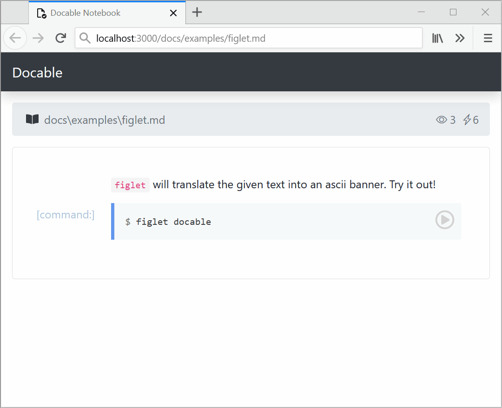
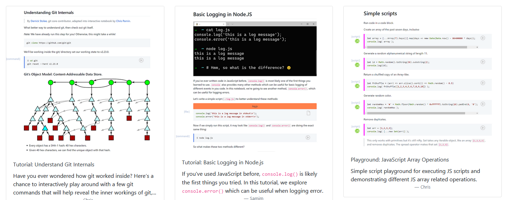
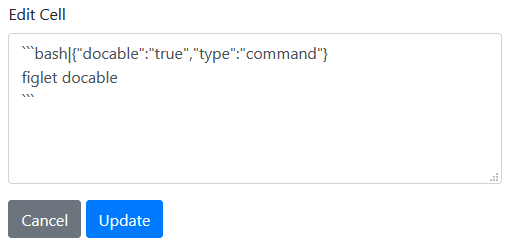
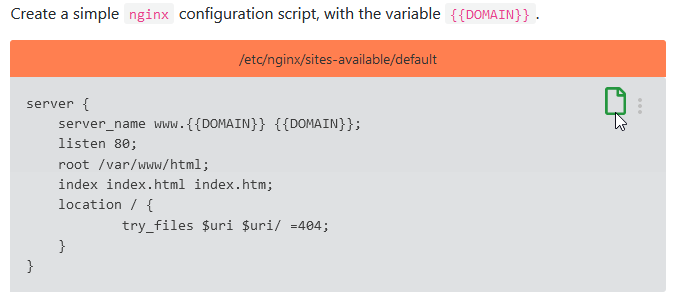
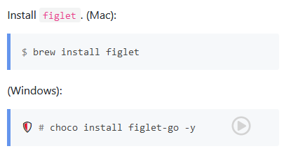
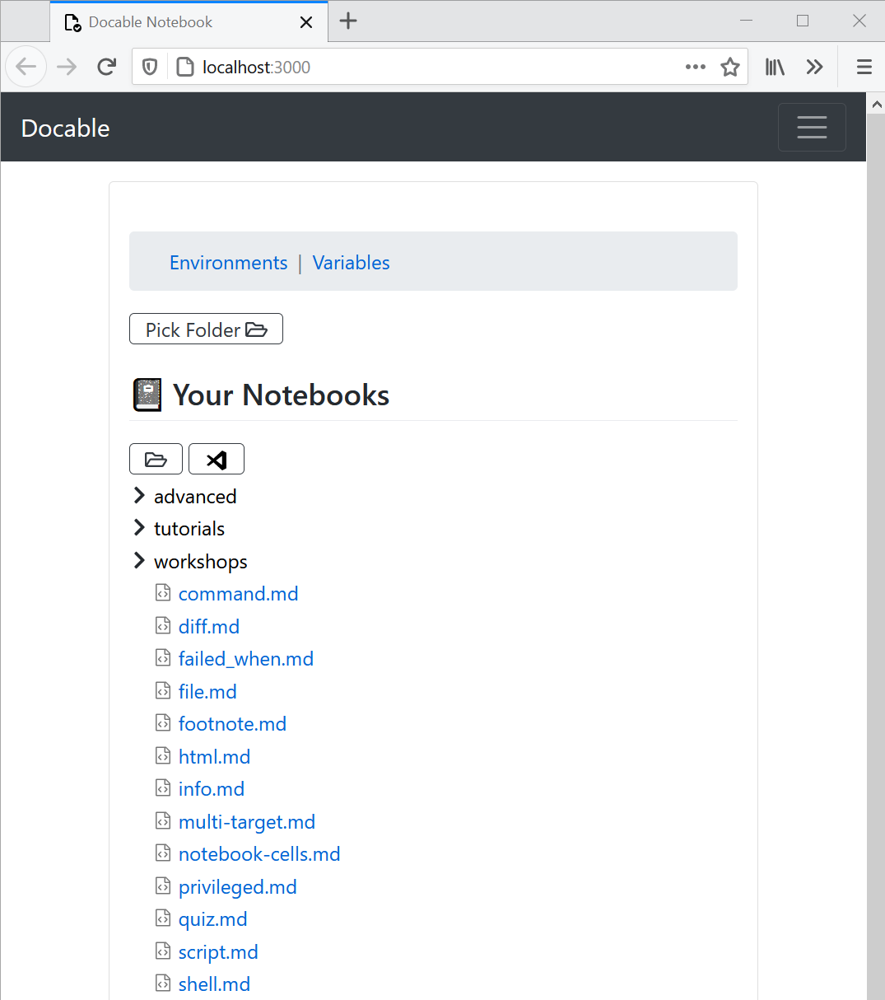
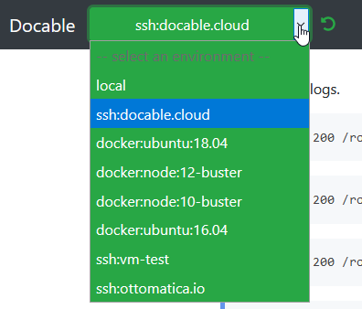
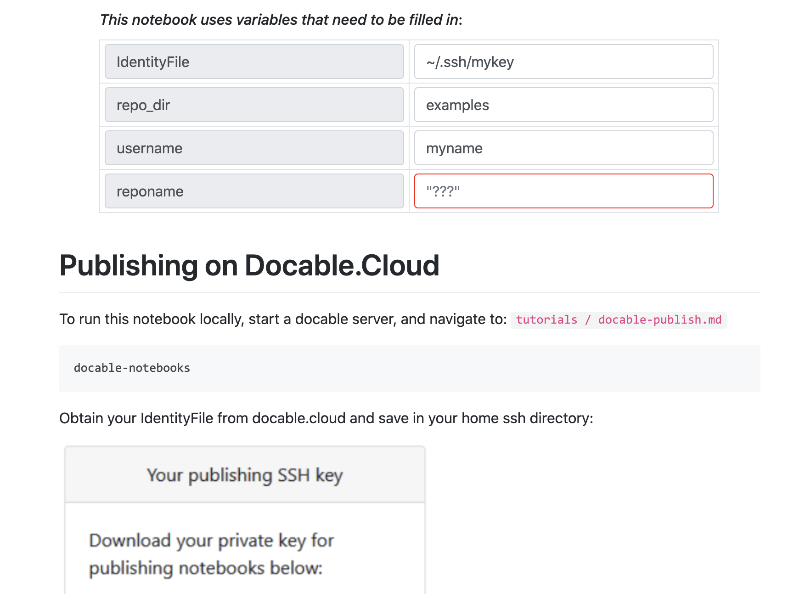

# Docable

> Next-Generation Interactive Notebooks

`docable` will create an interactive notebook from a Markdown file. Docable works by translating markdown files into interactive cells, which can be run, edited, and shared.

This results in a literate programming environment for markdown files. Markdown files remain 100% compatible and render normally on GitHub, etc. If done properly, Docable can allow you to design and build interactive tutorials, interactive education and training materials, and simple infrastructure runbooks.

## Using a Docable Notebook

With docable, your markdown will be translated from this:

`figlet` will translate the given text into an ascii banner. Try it out!

```bash|{type: 'command'}
figlet docable
```

**Into this**:



### Example Notebooks



See more features by exploring the [documentation examples](docs/examples/).

### Editing Cells

Docable cells can be edited and run again.



### Creating file content, using variables, and more.

Docable has been designed after [studying over 600 online tutorials](http://chrisparnin.me/pdf/docable_FSE_20.pdf) and discovering issues that contribute to poor learner experiences. We've designed a few additional features that smooth over these issues for tutorial takers and authors.

One of the most common problem was the numerous and inconsistent ways tutorials asked someone to edit a file on a server.
Docable _file cells_ take care of creating paths, setting file permissions and owners, and filling in variable content—with a simple click.



## Creating and Viewing Notebooks

To create a notebook, you simply create a markdown file and provide a few annotations on code blocks.

~~~
```bash|{type: 'command'}
figlet docable
```
~~~

A docable file cell can be created as follows.
~~~bash
```js|{type:"file",path:'id.js'}
Math.random().toString(36).substring(2);
```
~~~

Special annotations can also be provided on commands, allowing even better experiences, such as auto-detecting platforms to enable/disable cell execution.

~~~bash
```bash|{type: 'command', privileged: true, platform: 'win32'}
choco install figlet-go -y
```
~~~



### Notebook Treeview



### Target Environments

Docable has different connectors to run against different kinds of environments. Use the dropdown menu to select an environment.



* **local**: The default environment is your local computer.
* **Docker**: If there is a running docker service, Docable can create a container to run operations in.
* **ssh**: Any virtual machine, created locally, or remotely can be targeted. You can use configure a new ssh connection at http://localhost:3000/targets, and then select in the dropdown menu of your notebook.

### Variables

Notebooks can ask for variables, such as a `HOSTNAME` or `RELEASE_TAGS`.



For sensitive variables, such as passwords, tokens, and ssh keys, these can be stored on the server and they will be masked when displayed in output.

## Installing and Running Docable Notebooks

Requires [node.js >= 12.x](https://nodejs.org/en/).

Simply clone this repository.
```bash|{type: 'command'}
git clone https://github.com/ottomatica/docable-notebooks/
```

Install dependencies and start server.
```bash|{type: 'command'}
cd docable-notebooks
npm install
npm run dev
```

Your Docable Notebooks can be interacted with at http://localhost:3000. You can set `PORT=4000` to use a different address.

You can also run directly, which will serve up notebooks in the current directory. You can change this with `notebook_dir=<path>`.

```bash|{type: 'command'}
cd docable-notebooks
npm link
docable-notebooks
```

#### Install help

* If you have problems with `gyp` on MacOs, [see this simple guide](https://medium.com/flawless-app-stories/gyp-no-xcode-or-clt-version-detected-macos-catalina-anansewaa-38b536389e8d) for setting up/reinstalling CommandLineTools.
* If updating existing repository, make sure to run `npm update && npm install` to get updates from modules.

## Quick Reference

* Run commands in cell: `{type: 'command'}`.
* Command modifiers.
   - `stream`: if `true`, then stdout/stderr is printed in output block as available.
   - `shell`: If given, then run command in provided shell. Supported: `'bash'`, `'powershell'`
   - `path`: set working directory of command.
   - `privileged`: Ask permission for an admin shell---useful for local installation. Only supported in local connections.
   - `user`: run command as as given user.
* File content: `{type: 'file'}`.
* File modifiers:
   - `path`: **Required**. The path to place contents.
   - `permission`: Set permissions of file, use any format given by supported by chmod (`'u+x'`, `'700'`).
   - `user`: Owner of file.
   - `mode`: If `'append'`, will add content to file instead of overwriting.

* Script content: `{type: script}`.
   - Execute content using the language of content in the first part of fence infostring. Supported: `js`. Create issue if another language is needed!

* Conditions:
  - `platform`: Allow cell to be executed only if connection is to given platform. Supported: `win32`, `darwin`, `linux`. 
  - `failed_when`: Node.js expression to evaluate whether command succeeded or not. For example, `'!stdout.includes("download completed.")'`.
  
* Variables:
  - `variables`: A comma seperated list of variables referenced in cell content. Inside cell block, use `{{variable_name}}`.
     

Experimental features:
  - `chart`: Create chart from cell output. 
  - `highlight`: Select text in output, and create a popover with more information.
  - `block`: Select text in output, and create a box, with height rows.
  - `range`: Select lines from cell to highlight. Useful for calling attention.
  - `svg`: Render content as svg.