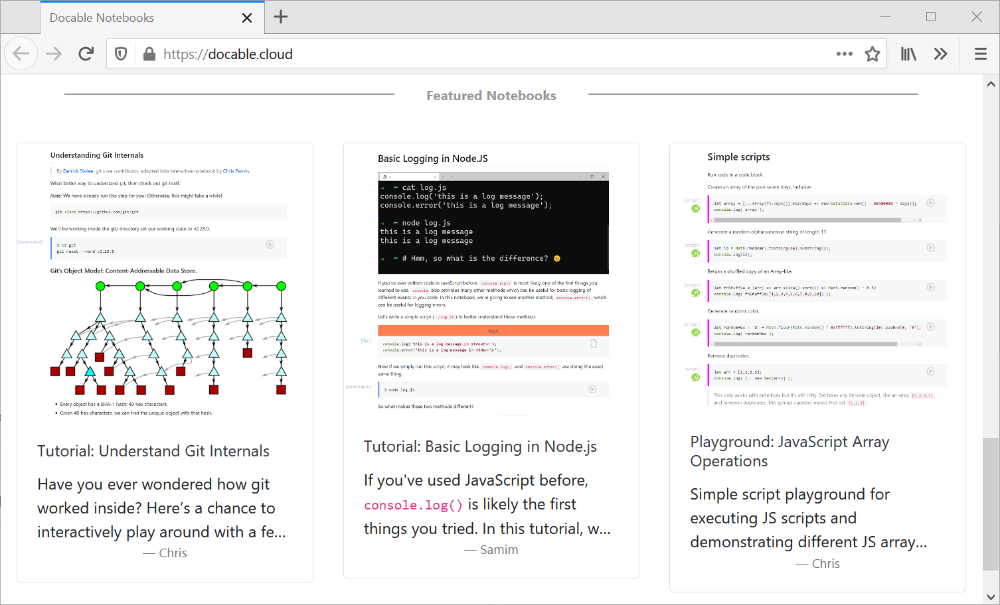

# Docable

> Next-Generation Interactive Notebooks 📒

`Docable` notebooks provide a literate programming environments which works great for writing and publishing interactive tutorials, training material for courses, blogs, or simple infrastructure runbooks. 

✨The interactive components include specialized cells for terminals, commands, scripts, files contents, quizes, and more. These interactive cells can be customized using several parameters and allow the reader to modify and execute the document.

✍ Authoring a `Docable` notebook is as easy as writing a Markdown file. The Markdown file, when opened in `Docable` will be rendered into interactive cells, which can be run, edited, and shared. This results in a literate programming environment for Markdown files. `Docable` notebook Markdown files remain 100% compatible and render normally on GitHub, etc.

Here is a preview of a markdown vs. GitHub vs. how the notebook works:


---

## Contents

* [Using Docable Notebooks](#using-docable-notebooks)
  - [Example notebooks](#example-notebooks)
  - [Editing cells](#editing-cells)
  - [Creating file content, using variables](#creating-file-content-using-variables-and-more)
  - [Cell format](#Cell-format)
  - [Docable CLI](#docable-cli)
* [Notebook Server](#notebook-server)
  - [Notebook treeview](#notebook-treeview)
  - [Managing environments](#target-environments)
  - [Managing variables](#variables)
* [Installing and Running Notebooks](#installing-and-running-docable-notebooks)
* [Quick Reference](#quick-reference)

## Using Docable Notebooks

With docable, your markdown will be translated from this:

~~~
`figlet` will translate the given text into an ascii banner. Try it out!

```bash| {type: 'command'}
figlet docable
```
~~~


Into this ✨:

<p align="center">
  
</p>

Docable's interactive cells are simply Markdown code block (```) with addition of a few annotations as a JSON which defines the type of the cell and other details about how it should be executed. In the example above, we created a command cell by adding `|{type: 'command'}`. 

✨ _These code blocks are 100% compatible with GitHub's Markdown rendering and the JSON is simply ignored. So you can update your existing `README.md` or other documentation files to make them executable by Docable while they still look the same as before when viewed on GitHub!_

For a list of supported cells and supported modifiers for each type see [quick reference](#quick-reference) section below.

### Example Notebooks

You can find example for most of the supported features in the [documentation examples](docs/examples/) or try an [online notebook](https://docable.cloud/):

<p align="center">
  
</p>

### Editing Cells

All Docable cells can be edited and run again. Additionally, the `script` and `file` cells provide the same code editor you use on VSCode which include syntax highlighting and [intellisense](https://code.visualstudio.com/docs/editor/intellisense) documentation. 

<p align="center">
  
  
</p>

### Creating file content, using variables, and more.

Docable has been designed after [studying over 600 online tutorials](http://chrisparnin.me/pdf/docable_FSE_20.pdf) and discovering issues that contribute to poor learner experiences. We've designed a few additional features that smooth over these issues for tutorial takers and authors.

One of the most common problem was the numerous and inconsistent ways tutorials asked someone to edit a file on a server.
Docable _`file` cells_ take care of creating paths, setting file permissions and owners, and filling in variable content with a simple click.

<p align="center">
  
</p>

_Variables can be stored securely in Docable Notebook server and automatically masked in the outputs. See [#variables](#variables) section below for more details._

## Cell Format

To create a notebook, you simply create a markdown file and provide a few annotations on code blocks.

~~~
```bash|{type: 'command'}
figlet docable
```
~~~

A docable file cell can be created as follows.
~~~bash
```js|{type:"file",path:'id.js'}
Math.random().toString(36).substring(2);
```
~~~

Special annotations can also be provided on commands, allowing even better experiences, such as auto-detecting platforms to enable/disable cell execution.

~~~bash
```bash|{type: 'command', privileged: true, platform: 'win32'}
choco install figlet-go -y
```
~~~

<kbd>


</kbd>

### Docable CLI

You can also run your markdown files with the [docable CLI](https://github.com/ottomatica/docable), allowing you to run your notebooks in CI/CD or gitops workflows: 

`$ docable report server-test.md`

<kbd>


</kbd>

## Notebook Server

The notebook server can run locally and allow you to interact with your notebooks in your web browser. Run the command below to start the server in your current working directory:

```bash
# if using the Docable tray app
docable-server .

# if installed from source
docable-notebooks .
```

Then you will be able to browse your notebooks on `http://localhost:3000/`. On the home page you will see the notebook treeview which allows you navigate and open different pages.

### Notebook Treeview

To access your notebooks, you can browse and click on a notebook in the tree.

<p align="center">
  
</p>

### Target Environments

Docable has different connectors to run against different kinds of environments. Use the dropdown menu to select an environment.

<kbd>


</kbd>

* **local**: The default environment is your local computer.
* **Docker**: If there is a running docker service, Docable can create a container to run operations in.
* **ssh**: Any virtual machine, created locally, or remotely can be targeted. You can use configure a new ssh connection at http://localhost:3000/targets, and then select in the dropdown menu of your notebook.

### Variables

As we showed above, Docable supports variables in the notebooks. These variables can be stored in the notebook server to be reused in the future and in multiple notebooks. 

<p align="center">
  
</p>


🔐 Sometimes these variables contain sensitive information such as API tokens, passwords and ssh keys. Notebook server can encrypt and store these variables for future reuse. As shown above, Docable automatically masks these values when they are displaying anywhere in the notebook or the execution outputs. 

## Installing and Running Docable Notebooks

You can run Docable Notebooks by installing either the Docable tray app or the CLI server from source. We recommend trying our [tray app](#docable-tray-app-recommended) since it includes closed-source features not included in this repository.

### Docable Tray App (recommended)

You can find [installation instructions here](./docs/install.md). Docable tray is a GUI app which runs in your operating system's menu bar and allows you control (start/stop) the Docable server. This is the recommended method of running Docable Notebooks which includes the Terminal cell feature.

### Install from source

Requires [node.js >= 12.x](https://nodejs.org/).

Simply clone this repository.
```bash|{type: 'command'}
git clone https://github.com/ottomatica/docable-notebooks/
```

Install dependencies and start server.
```bash|{type: 'command'}
cd docable-notebooks
npm install
npm run dev
```

Your Docable Notebooks can be interacted with at http://localhost:3000. You can set `PORT=4000` to use a different address.

You can also run directly, which will serve up notebooks in the current directory. You can change this with `--notebook_dir <path>`.

```bash|{type: 'command'}
cd docable-notebooks
npm link
docable-notebooks
```

_Installation help for running from source:_
* If you have problems with `gyp` on MacOs, [see this simple guide](https://medium.com/flawless-app-stories/gyp-no-xcode-or-clt-version-detected-macos-catalina-anansewaa-38b536389e8d) for setting up/reinstalling CommandLineTools.
* If updating existing repository, make sure to run `npm update && npm install` to get updates from modules.

## Quick Reference

* Run commands in cell: `{type: 'command'}`.
    * Command modifiers.
        - `stream`: if `true`, then stdout/stderr is printed in output block as available.
        - `shell`: If given, then run command in provided shell. Supported: `'bash'`, `'powershell'`
        - `path`: set working directory of command.
        - `privileged`: Ask permission for an admin shell---useful for local installation. Only supported in local connections.
        - `user`: run command as as given user.

* Create file with given content: `{type: 'file'}`.
    * File modifiers:
        - `path`: **Required**. The path to place contents.
        - `permission`: Set permissions of file, use any format given by supported by chmod (`'u+x'`, `'700'`).
        - `user`: Owner of file.
        - `mode`: If `'append'`, will add content to file instead of overwriting.

* Script content: `{type: 'script'}`.
   - Execute content using the language of content in the first part of fence infostring. Supported: `js`. Create issue if another language is needed!

* Multiple-choice quiz: `{type: 'quiz'}`
    * Quiz modifiers:
        - `quiz_type`: This can be set to either `multichoice` or `singlechoice`.
        - `quiz_answers`: Specify the correct answer for the quiz, using index of your choices starting from 0. If more than one choice, separate by comma `0,1`.
        - content of cell should be checkbox bulletpoint `- [ ] foo` 

* Embed interactive terminal: `{type: 'terminal'}`.
    * Terminal modifiers:
        - `command`: The command to start your interactive shell. For example, this can be `bash` for bash shell or `node` for starting a node.js REPL.

* Conditions:
  - `platform`: Allow cell to be executed only if connection is to given platform. Supported: `win32`, `darwin`, `linux`. 
  - `failed_when`: Node.js expression to evaluate whether command succeeded or not. For example, `'!stdout.includes("download completed.")'`.
  
* Variables:
  - `variables`: A comma seperated list of variables referenced in cell content. Inside cell block, use `{{variable_name}}`.
     

Experimental features:
  - `chart`: Create chart from cell output. 
  - `highlight`: Select text in output, and create a popover with more information.
  - `block`: Select text in output, and create a box, with height rows.
  - `range`: Select lines from cell to highlight. Useful for calling attention.
  - `svg`: Render content as svg.
  - `tty`: Run command with pty.
