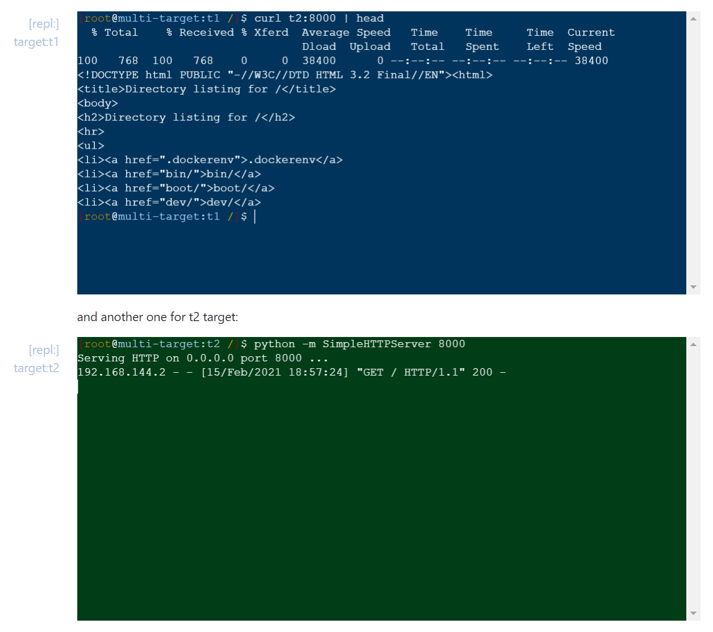

<!-- 
targets:
    - type: docker
      name: t1
      image: node:12-buster
    - type: docker
      name: t2
      image: node:12-buster
 -->

# Multi-target notebook

If a list of targets is provided in notebook's "setup stanza" as shown below, 

```yaml
<!-- 
targets:
    - type: docker
      name: t1
      image: node:12-buster
    - type: docker
      name: t2
      image: node:12-buster
-->
```

cells can specify the target they should execute in using a `target` property. For example, if we create a command cell using this markdown below, the command will run in **t2**.

    ```bash|{type:'command', target: 't2'}
    touch /tmp/hello_world
    ```

You can also see the selected target in the rendered view next to the cell:

```bash|{type:'command', target: 't2'}
touch /tmp/hello_world
```


And if `target` is not specified for a cell in a multi-target notebook, the first target from setup stanza will be used by default:

```bash|{type:'command'}
ls -al /tmp/hello_world
```

Now you can run the two Docable cells above ☝. First execute the cell with **t2** target to create a temp file. Then execute the second cell which uses **t1** target by default to confirm this file does not exist (two separate environments).


You can also use this `target` property in terminal cells. 

    ```bash|{type:'repl', target: 't1', 'background-color': '#00345c'}
    ```

Here is a rendered terminal for **t1** target:

```bash|{type:'repl', target: 't1', 'background-color': '#00345c'}
```

and another one for t2 target:

```bash|{type:'repl', target: 't2', 'background-color': '#013d17'}
```

Feel free to play around with these two terminals to confirm they are connected to different targets.

# Multi-target notebook network

Multi targets notebooks also provide a shared network between the current notebook's environments. For example you can run an HTTP server in one target and access it from the other target as you can see in this _screenshot_ (feel free to try this in live terminals above ☝):


