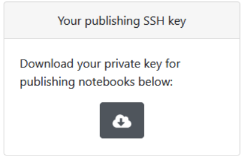

# Publishing on Docable.Cloud

To run this notebook locally, start a docable server, and navigate to:
`tutorials / docable-publish.md`

```bash
docable-notebooks
```

Obtain your IdentityFile from docable.cloud and save in your home ssh directory:



* `cd %USERPROFILE%\.ssh` in Windows
* `cd ~/.ssh`

Ensure that the file permissions of your identify file is appropriately set:

```bash |{type:'command', variables: 'IdentityFile, repo_dir'}
ls -l {{IdentityFile}}
```

If not, you can correct here:

```bash |{type:'command', variables: 'IdentityFile'}
chmod 600 {{IdentityFile}}
```

Add an entry to your ssh config file so that you can automatically use this private key.

```bash |{type:'file', path: '~/.ssh/config', mode: 'append', variables: 'IdentityFile'}
Host publish.docable.cloud
        HostName docable.cloud
        User git
        IdentityFile {{IdentityFile}}
```

Inside your repository `{{repo_dir}}`, add remote called `docable` to your notebooks repository.

```bash |{type:'command', variables: 'username, reponame, repo_dir'}
cd {{repo_dir}}
git remote add docable git@publish.docable.cloud:{{username}}/{{reponame}}.git
```

Test your connection!
```bash |{type:'command'}
ssh -T git@publish.docable.cloud
```

Make sure your repo can see the remote.

```bash |{type:'command', variables: 'repo_dir'}
cd {{repo_dir}}
git remote update
git status -uno
```

You can now publish your changes to docable.cloud!

```bash |{type:'command', variables: 'repo_dir', failed_when:'exitCode!=0'}
cd {{repo_dir}}
git push docable
```

Your notebooks will be visible at: `https://docable.cloud/{{username}}/{{reponame}}/`.