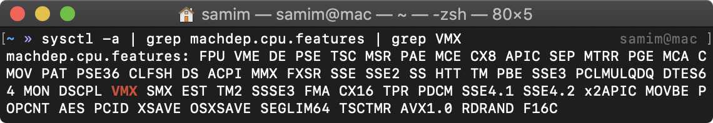

[Setup](Setup.md#setup) | [Shells](Shells.md#shells) |  [Git](Git.md#git) | [Markdown and IDEs](MarkdownEditors.md#markdown) |  [Virtual Environments](Environments.md#environments) | [Task Management](OnlineTools.md#online-tools)

# Computing Environments

Creating computing and development environments will be an essential skill for software engineering. Unfortunately, consistently getting software installed on a your computer and correctly setting up the environments can take away weeks of your productive time.

Virtual machines/containers can provide a useful solution for automating the creation and management of your computing environment and development workflow. Unfortunately, when developers think about virtual machines, a common idea that comes to mind is a dedicated heavy-weight virtualized system with a full graphics Desktop. Alternatively, you may think of dual-booted systems. While these types of systems can be useful, the goal of this workshop is to introduce you to a different concept for software development.

## A philosophy: Be able to throw away your machine and still code

> Code that only runs on your machine is useful to no one else

With computing environments, we are able to automate the specification of our environment for running our code, which makes it easier for us to recreate and share our computing environments with others on a new machine.

To use a computing environment, you can use your host operating system to write code, interact with the running program, and visualize its executions. But you avoid execution code on your own machine itself---that all happens inside the computing environment.

> Computing environments are for running code, not writing code.

To accomplish this, we use a set of tools to enable you to map files and program between your host environment and computing environment. 

## Setting up Virtualization

[VirtualBox](https://www.virtualbox.org/wiki/Downloads) is a lightweight virtualization provider. It is very effective for creating *headless* virtual machines that run without any GUI/Desktop interface.

Install VirtualBox.

```bash|{type:'command', privileged: true, platform: 'win32'}
choco install virtualbox -y
```

```bash|{type:'command', platform: 'darwin'}
brew cask install virtualbox
```

> Mac: `virtualbox` requires a kernel extension to work.
> If the installation fails, retry after you enable it in:
>    System Preferences → Security & Privacy → General

### Ensure virtualization is enabled

To be able to run virtual machines, your machine needs to support virtualization. 
Ensure virtualization (Intel VT-x or AMD-V) is enabled on your system using the instructions for your operating system:  
- **Windows:** open Task Manager and go to Performance tab, and you should see virtualization is enabled.
  

- **Mac:** run the command below to see the list of supported CPU flags. If you see **VMX**, your machine supports hardware virtualization:  

   ```bash |{type:'command', platform: 'darwin'}
   sysctl -a | grep machdep.cpu.features | grep VMX
   ```
   
   
- **Linux:** run the command below to see the list of supported CPU flags. If you see **VMX** or **SVM** flag, youre machine supports hardware virtualization:

   ```
   grep -E "vmx|svm" /proc/cpuinfo
   ```
   

### Debugging virtualization issues

> Windows: If you're running Hyper-V and VirtualBox, and you're experiencing crashes when you try to start a VM, you may need to [turn off Hyper-V](https://superuser.com/questions/540055/convenient-way-to-enable-disable-hyper-v-in-windows-8) (which exclusively locks use of CPU for virtualization).

> Linux: If you run `vboxmanage list vms` command and you get `WARNING: The vboxdrv kernel module is not loaded...` error, see the dicussion [here](https://askubuntu.com/a/229908) for how to fix it.

## Creating a Virtual Machine

While it is possible to use the VirtualBox GUI to manually install a virtual machine (and run through the OS installation script); this is not an effective automation approach!

### Install bakerx

`bakerx` is a simple tool for creating and managing virtual machines.

```bash|{type:'command'}
npm install ottomatica/bakerx -g
```

### Using `bakerx`

#### Pulling images

First, you need to pull an existing virtual machine image from a registry. Registries are basically the assets in a GitHub repository releases. Then you can pull an image by running the following commands:

```bash|{type:'command'}
bakerx pull alpine3.9-simple ottomatica/slim#images 
```

See [slim](https://github.com/ottomatica/slim) for instructions on how to create and publish an image. 

#### Creating VMs

After pulling images, you can create VMs that run those images. Simply run the command below:

```bash|{type:'command', stream: true, failed_when:'exitCode!=0'}
bakerx run example_alpine_vm alpine3.9-simple --memory 1024
```

> The `--memory | -m` flag is optional, and can be used to set the amount of shared memory with your virtual machine.

#### Connecting to VMs

Finally, bakerx will give you an `ssh` command similar to what is shown below, which you can use to connect to the VM.

```bash|{type:'command', interactive: true}
bakerx ssh example_alpine_vm
```

#### Deleting VMs

When you're done, you can stop and delete the VM.

```bash|{type:'command'}
bakerx delete vm example_alpine_vm
```
