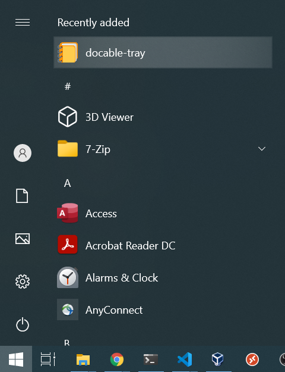
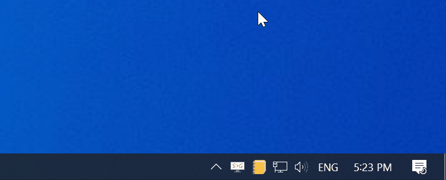

# Installing and Running Docable Notebooks Tray app

Download and run the installer for your operating system from the links below:

- Windows: [`stable`](https://github.com/ottomatica/docable-notebooks/releases/latest/download/docable-tray.exe) - [`preview`](https://github.com/ottomatica/docable-notebooks/releases/download/preview/docable-tray.exe)
- macOS: [`stable`](https://github.com/ottomatica/docable-notebooks/releases/latest/download/docable-tray.dmg) - [`preview`](https://github.com/ottomatica/docable-notebooks/releases/download/preview/docable-tray.exe)
- Linux: [`stable`](https://github.com/ottomatica/docable-notebooks/releases/latest/download/docable-tray.deb) - [`preview`](https://github.com/ottomatica/docable-notebooks/releases/download/preview/docable-tray.deb) -- _see note below about dependency problems._

After running the installer, you should be able to find the docable-tray app icon in your application list:

> _**Note about Linux**: when installing `.deb` using `sudo dpkg -i docable-tray.deb`, you may get `dependency problems prevent configuration of docable-tray.app` error. To resolve this, simply run `sudo apt-get -f install` to automatically install the needed dependencies._

# Windows

Run the docable-tray app to start Docable Notebooks server in the background. 

You can confirm the Docable Notebook has started successfully, by righ-clicking on the Docable icon in Windows Taskbar and clicking on "Open Docable...".

Your default browser should now open `http://localhost:3000/`.

# macOS

Run docable-tray app to start Docable server in the background. Then you can confirm the Docable Notebooks has started successfully, by right-clicking on the Docable icon in macOS menu bar and clicking on "Open Docable...".

  

Your default browser should now open `http://localhost:3000/` which is the Docable Notebooks home page.

# macOS

Run docable-tray app to start Docable server in the background. Then you can confirm the Docable Notebooks has started successfully, by right-clicking on the Docable icon in menu bar and clicking on "Open Docable...".

  

Your default browser should now open `http://localhost:3000/` which is the Docable Notebooks home page.

# Updating

To update the docable-tray app, download and run the latest installers from [installation section](#installing-and-running-docable-notebooks-tray-app) above.

