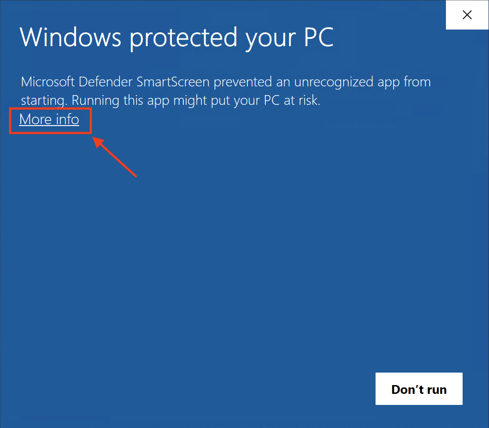
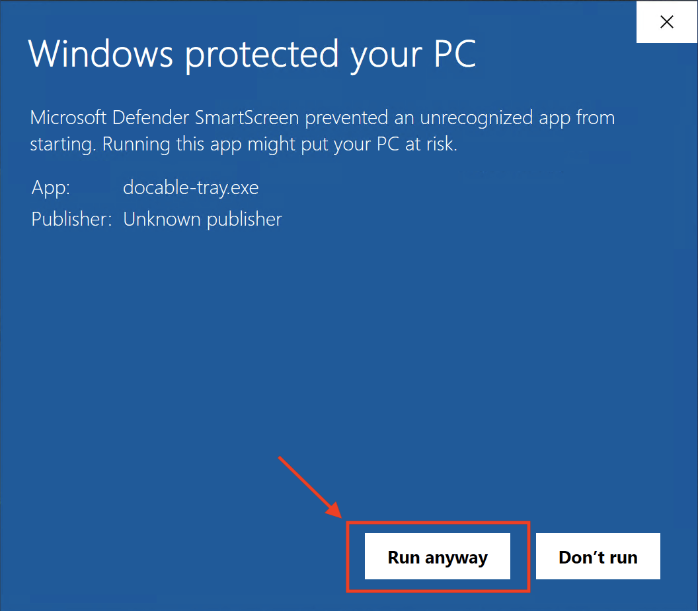
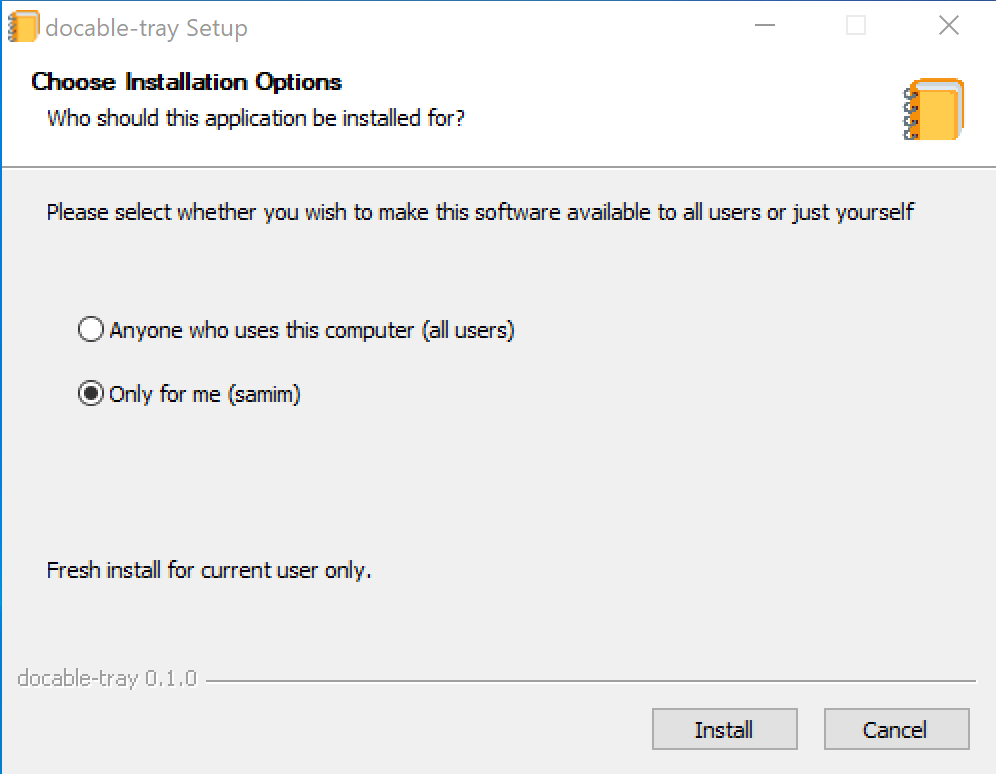
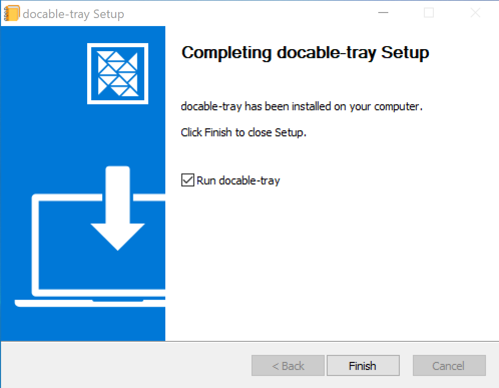
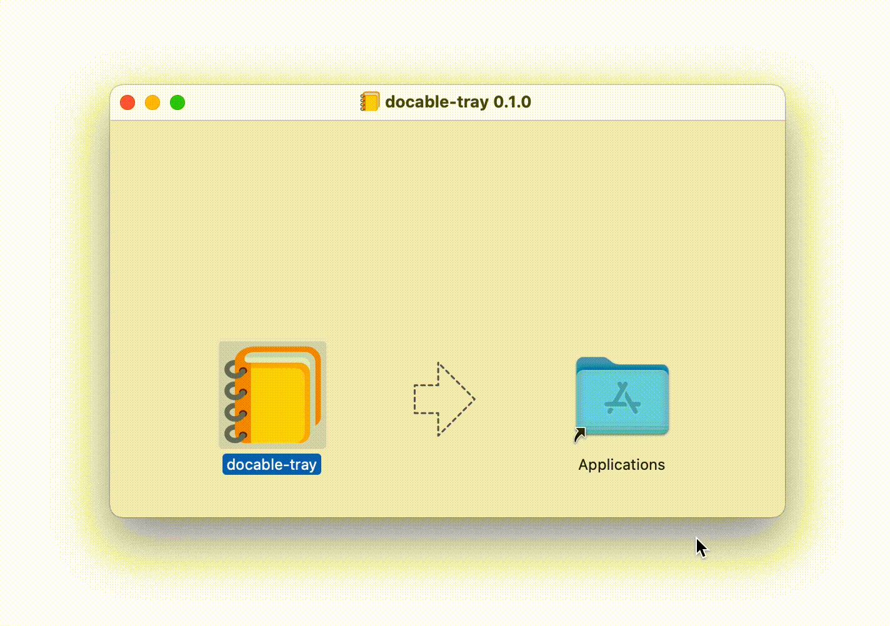
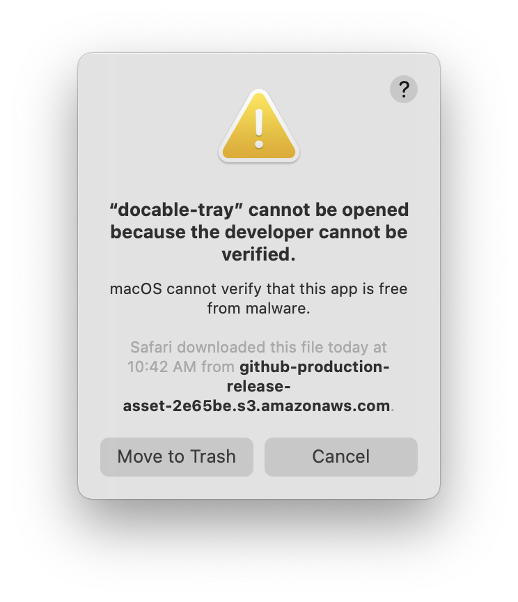
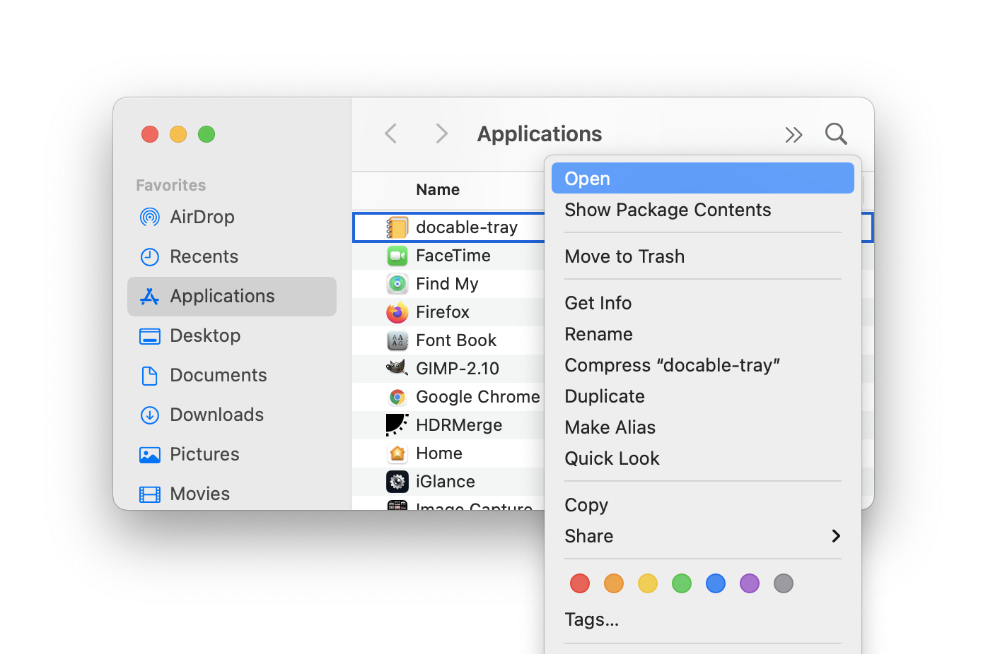
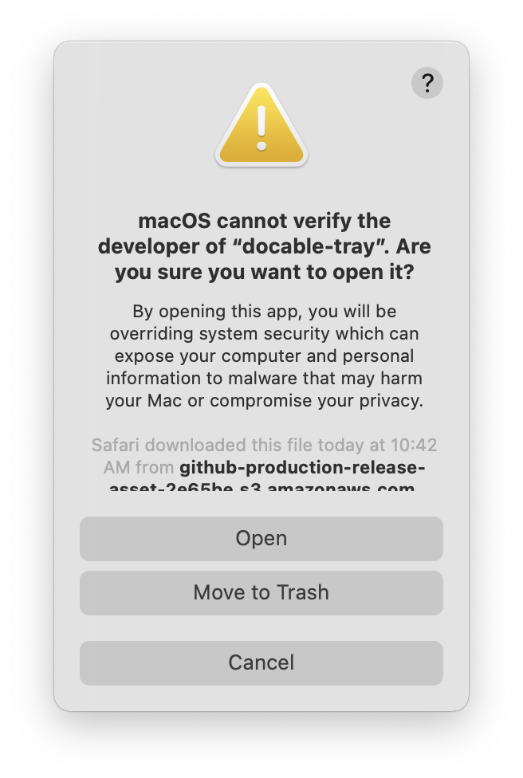
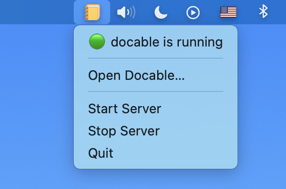

# Docable Tray app

- [Installation](#Installation) [[Windows](#Windows), [macOS](#macOS), [Linux](#Linux)]
- [Components](#Components)
- [Usage](#Usage)
- [Updating](#Updating)

---
## Installation

> _**Note: What is the difference between stable and preview installers?**  
   `stable` installer is the latest version of Docable Notebooks which was released, and `preview` installer includes the latest unrelease changes from master branch.  
   Typically you should install the stable version, unless you need a feature that was recently added to Docable Notebooks and is still not published in one of the releases._

### Windows

Download the Windows installer [[`stable`](https://github.com/ottomatica/docable-notebooks/releases/latest/download/docable-tray.exe) - [`preview`](https://github.com/ottomatica/docable-notebooks/releases/download/preview/docable-tray.exe)] and run it.

To allow Windows smartscreen to continue with the installation, click on "_More info_". Then, proceed to the installation by selecting "_Run anyway_".




You will be presented with the installer, we recommend to continue with the default setting which installs Docable Tray only for your user. 

<p>
  
  
</p>

After the installation is completed, continue to [Components](#Components) and [Usage](#Usage) sections below.

### macOS

Download and open macOS [[`stable`](https://github.com/ottomatica/docable-notebooks/releases/latest/download/docable-tray.dmg) - [`preview`](https://github.com/ottomatica/docable-notebooks/releases/download/preview/docable-tray.dmg)] dmg.

After the dmg image has been mounted, simply drag and drop `docable-tray` to your "_Applications_" folder.

<p align="center">
  
</p>

Depending on your system settings, macOS may show a prompt similar below that prevents you from starting the application. 

<p align="center">
  
</p>

In this case, right click on the docable-tray application and open the file.

<p align="center">
  
</p>

You will be presented with a prompt which now gives you an option to open the application. Select "_Open_" again. Note, you only need to do this the first time you start Docable Tray.

<p align="center">
  
</p>


After the installation is completed, continue to [Components](#Components) and [Usage](#Usage) sections below.
### Linux

Download and run the `.deb` installer ([`stable`](https://github.com/ottomatica/docable-notebooks/releases/latest/download/docable-tray.deb) - [`preview`](https://github.com/ottomatica/docable-notebooks/releases/download/preview/docable-tray.deb))

Use `dpkg` to install the `.deb` file.

```bash
sudo dpkg -i docable-tray.deb
```

> _**Note**: when installing `.deb`, you may get a `dependency problems prevent configuration of docable-tray.app` error. To resolve this, simply run `sudo apt-get -f install` to automatically install the needed dependencies._

After the installation is completed, continue to [Components](#Components) and [Usage](#Usage) sections below.

## Components

To better understand and correctly use Docable Tray app, it is good to know how Docable Tray app works in the background. There are two main components that you should know about:

### 1. docable-tray app

This is the GUI component, which handles running Docable Notebooks server in the background automatically and showing the Docable icon in the Menu bar which gives you options for stopping and starting the Docable Notebook server. 

<p align="center">
  
</p>

### 2. Docable Notebooks (server)

`docable-server` is the cli components of the application, which provides similar functionality found in [`ottomatica/docable-notebooks`](https://github.com/ottomatica/docable-notebooks). When installing Docable Tray app, this cli component is added to your system's PATH environment variable and can be executed by running `docable-server`. 

For example, you can import notebooks from cli by running:

```bash
$ docable-server import https://github.com/ottomatica/docable-notebooks
```

Or you can even start Docable Notebooks server, without using the GUI component. [_Note: if Docable Tray app (GUI component) is started, server is already running in the background, so this command will fail._]

```bash
$ docable-server -d ~/docable
```

## Usage

To use Docable Notebooks, start the docable-tray app from your operating system's applications list. This will also start the Docable Notebooks server in the background.

You can confirm the Docable Notebook has started successfully, by righ-clicking on the Docable icon in Windows Taskbar and clicking on "Open Docable...".
Then, your default browser should now open `http://localhost:3000/`.


## Updating

To update the docable-tray app, download latest version of Docable Tray and re-run the installer as explained in [installation section](#Installation) above.


